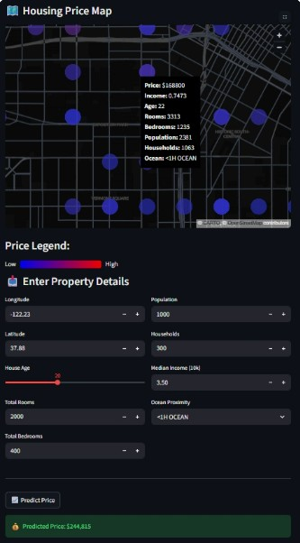

#  California Housing Price Predictor

This project is an end-to-end machine learning application that predicts housing prices in California based on demographic and location data. It also includes an interactive map for exploring real housing data.

---
##  Data Source

The dataset used in this project is the California Housing dataset, popularized by *Hands-On Machine Learning with Scikit-Learn & TensorFlow* by Aurélien Géron. It is derived from the 1990 U.S. Census and is widely used for machine learning practice and benchmarking.
Note on data:
The California Housing dataset used in this project originates from the 1990 U.S. Census and is commonly used for educational purposes. It is not covered by this repository’s MIT license.

##  Live Demo


https://housingpredictiondashboard.streamlit.app/

---

##  Project Overview

The goal of this project was to go beyond just building a model in a notebook and actually deploy it as a usable application.

The app allows users to:

* Explore real housing data on an interactive map
* Input property features
* Get a predicted house price instantly

---

##  Model

* Model: Random Forest Regressor
* RMSE: 40609.0516
* Includes full preprocessing pipeline:

  * Missing value handling
  * Feature scaling
  * Custom feature engineering (ratios)
  * Clustering-based feature (KMeans similarity)
  * One-hot encoding

The entire pipeline is saved and deployed as a single `.pkl` file.

---

##  Interactive Map

* Built using PyDeck
* Displays housing data across California
* Color-coded by house price
* Hover to view:

  * Price
  * Income
  * Population
  * Rooms / Bedrooms
  * Ocean proximity

---

##  Tech Stack

* Python
* Streamlit
* Scikit-learn
* Pandas / NumPy
* PyDeck

---


##  How to Run Locally

```bash
pip install -r requirements.txt
streamlit run app.py
```

---

##  Key Takeaways

* Median income is the strongest predictor of housing prices
* Location (latitude/longitude) has a major impact
* Ocean proximity adds a noticeable premium
* Feature engineering and preprocessing significantly improved performance

---

##  Notes

* The model is not intended for real-world financial decisions
* Dataset limitations mean predictions may not generalize perfectly

---

##  Future Improvements

* Highlight predicted location on the map
* Add filtering (income, proximity, etc.)
* Improve UI/UX
* Try lighter or more efficient models for deployment

---

##  Acknowledgment

Dataset based on the California Housing dataset from the book *Hands-On Machine Learning with Scikit-Learn & TensorFlow*.

---

# Screenshot


---
